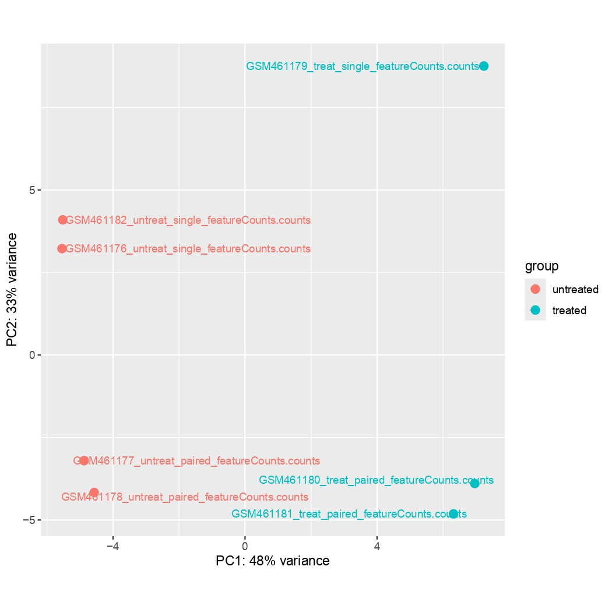
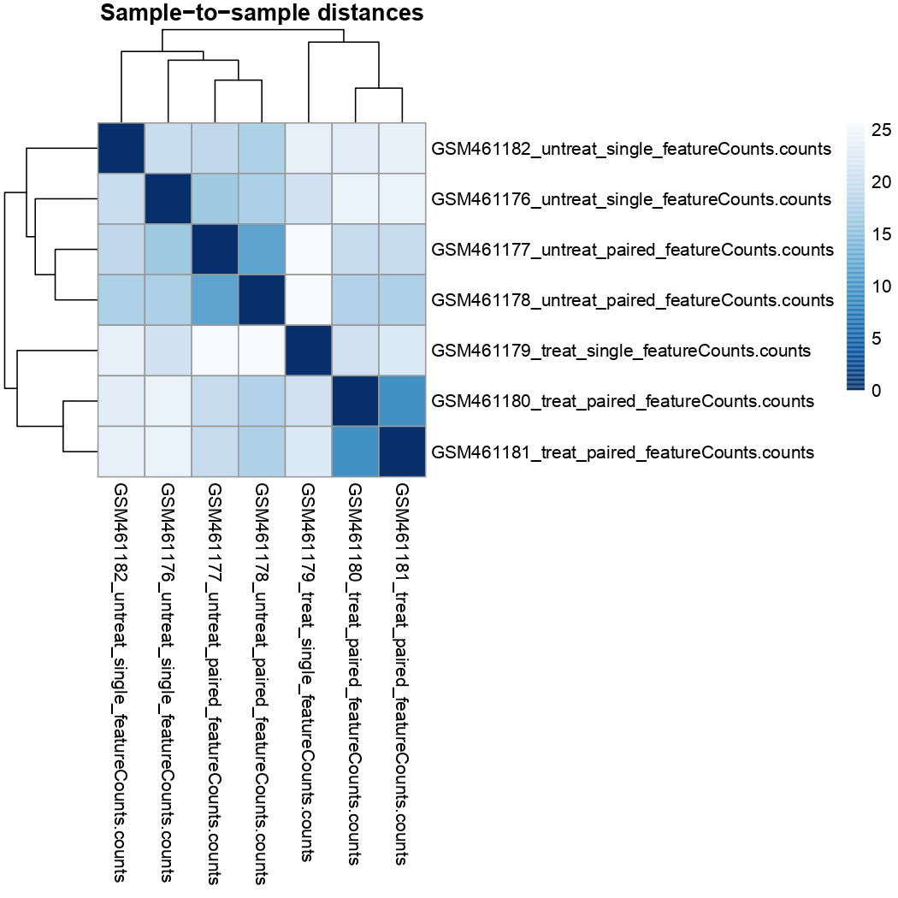
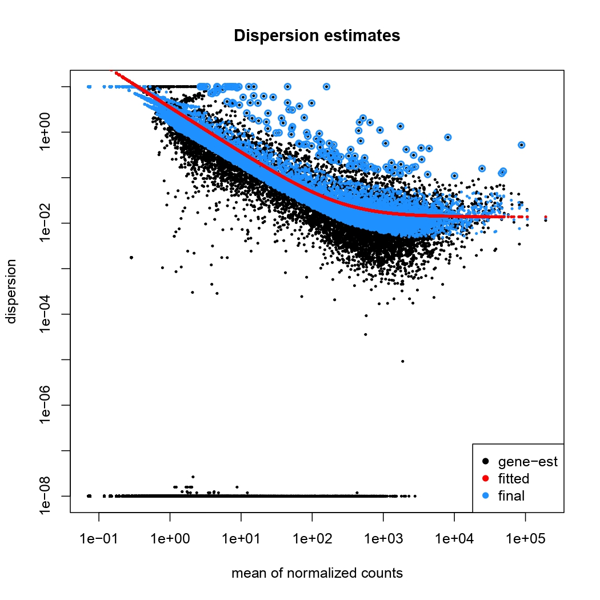
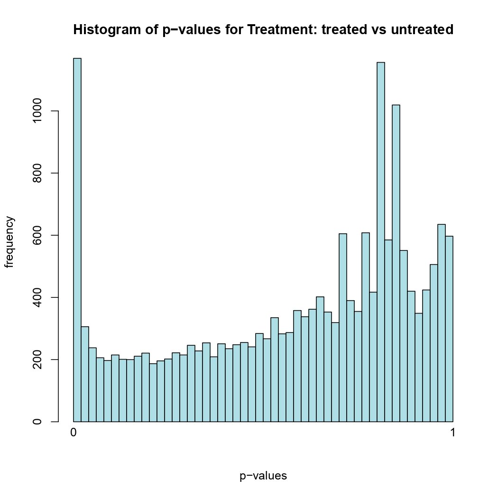
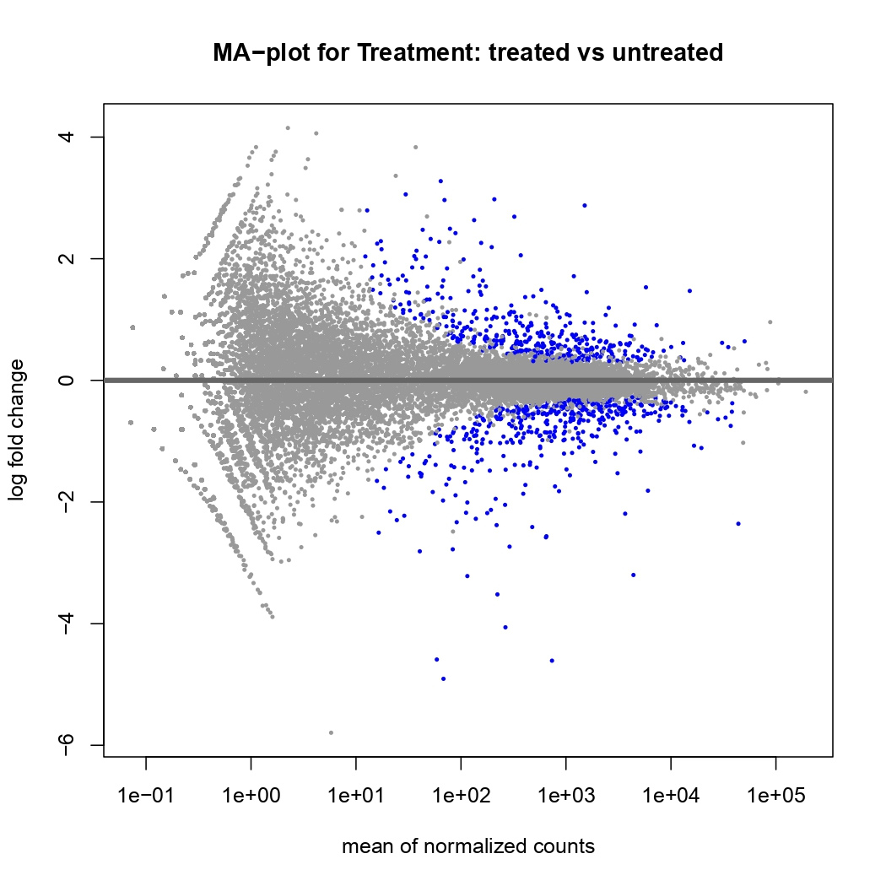
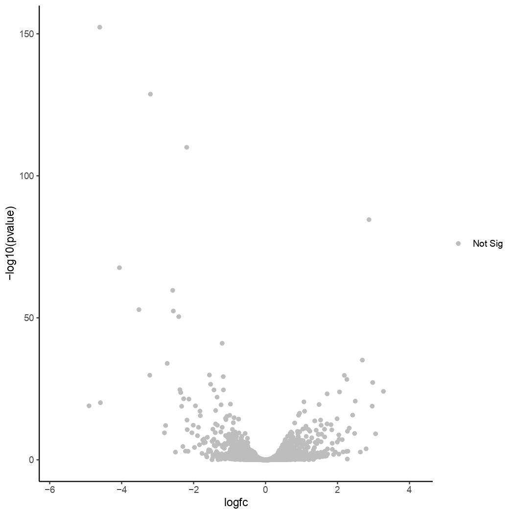

# RNA-seq Analysis, Drosophila melanogaster

Reference-based RNA-seq analysis of *Drosophila melanogaster* to identify differentially expressed genes following *pasilla* gene knockdown, following the GTN tutorial on Galaxy.

## Overview

This repository documents a complete reference-based RNA-seq pipeline run on *Drosophila melanogaster*, carried out as part of the Galaxy Training Network tutorial. The goal was to identify genes that are differentially expressed between *pasilla*-depleted (treated) samples and untreated controls, starting from raw paired-end and single-end FASTQ reads and ending with an annotated list of significant DE genes and a volcano plot.

The *pasilla* (*ps*) gene encodes a nuclear RNA-binding protein and is the *Drosophila* homologue of the mammalian splicing regulators Nova-1 and Nova-2. It plays a role in the regulation of alternative splicing across hundreds of target transcripts. The dataset used here comes from Brooks et al. (2011), one of the earliest papers to apply RNA-seq to characterise splicing regulation genome-wide in *Drosophila*. In that study, *pasilla* was depleted by RNA interference (RNAi) and total RNA was isolated from both treated and untreated cells. Libraries were prepared as both paired-end and single-end Illumina sequencing runs, giving a set of 7 samples in total.

This analysis re-implements the core differential expression workflow from raw reads through to biological interpretation: quality control, adapter trimming, splice-aware alignment, read counting, normalisation, differential expression testing, annotation, and visualisation. The multi-factor DESeq2 design accounts for both the treatment condition and the sequencing type (paired-end vs single-end), allowing the effect of *pasilla* depletion to be estimated while controlling for library type.

All steps were run on [usegalaxy.eu](https://usegalaxy.eu).

## Repository Structure

```
.
├── images/                               # figures exported from the DESeq2 output PDF
│   ├── pca_plot.jpg                      # PCA of all 7 samples coloured by condition
│   ├── sample_distance_heatmap.jpg       # hierarchical clustering of sample-to-sample distances
│   ├── dispersion_estimates.jpg          # per-gene dispersion estimates and the fitted trend
│   ├── pvalue_histogram.jpg              # distribution of raw p-values across all tested genes
│   ├── ma_plot.jpg                       # MA plot: log2 fold change vs mean normalised expression
│   └── volcano_plot.jpg                  # volcano plot: log2FC vs adjusted p-value significance
├── results/
│   ├── qc/                               # MultiQC HTML reports for each stage of the pipeline
│   │   ├── multiqc_falco.html            # QC metrics for raw reads (per-base quality, GC, duplication)
│   │   ├── multiqc_cutadapt.html         # trimming stats: reads removed, bases trimmed per sample
│   │   ├── multiqc_star.html             # alignment rates: uniquely mapped, multi-mapped, unmapped
│   │   └── multiqc_featurecounts.html    # assignment rates: assigned, unassigned ambiguous/multimapping
│   ├── deseq2/                           # all DESeq2 outputs
│   │   ├── deseq2_results.tabular        # full results table: all genes with LFC, p-value, padj
│   │   ├── deseq2_plots.pdf              # DESeq2 diagnostic plots: MA, PCA, heatmap, dispersion
│   │   ├── normalized_counts.tabular     # DESeq2 size-factor normalised count matrix (all samples)
│   │   ├── deseq2_annotated.tabular      # results table with gene names and descriptions appended
│   │   ├── deseq2_significant.tabular    # subset filtered to padj < 0.05
│   │   └── deseq2_significant_cut.tabular# significant genes with selected columns only
│   └── figures/                          # standalone figure exports
│       └── volcano_plot.pdf              # volcano plot PDF as exported from Galaxy
├── methods.md                            # detailed step-by-step methods with tool versions and parameters
└── README.md
```

## Pipeline

```
Raw reads (4 untreated + 3 pasilla-depleted samples; paired-end and single-end FASTQ)
        |
    Falco — per-sample quality assessment: base quality scores, GC content,
            sequence duplication levels, adapter contamination
        |
    MultiQC — aggregates all Falco reports into a single interactive HTML
        |
    Cutadapt — trims adapter sequences and low-quality 3' bases (quality cutoff Q20,
               minimum length 20 bp); paired reads trimmed together to preserve pairing
        |
    MultiQC — aggregates Cutadapt trimming reports: reads passing filter, bases trimmed
        |
    RNA STAR — splicing-aware alignment to the dm6 reference genome using the
               Drosophila melanogaster GTF annotation for splice junction guidance;
               produces coordinate-sorted BAM files
        |
    MultiQC — aggregates STAR alignment logs: mapping rates, splice junction stats
        |
    featureCounts — counts reads mapping to each annotated gene using the dm6 GTF;
                    outputs count matrix and per-sample assignment summaries
        |
    MultiQC — aggregates featureCounts summary: assigned vs unassigned reads per sample
        |
    DESeq2 — two-factor differential expression analysis (treatment + sequencing type);
             applies median-of-ratios normalisation, estimates dispersions,
             fits negative binomial GLM, performs Wald test for treatment effect
        |
    Annotate DESeq2 output — joins results table with a Drosophila gene annotation
                             table to add gene names and functional descriptions
        |
    Filter (padj < 0.05) — retains only statistically significant DE genes after
                           Benjamini-Hochberg multiple testing correction
        |
    Volcano Plot — plots log2 fold change vs -log10(padj) for all tested genes,
                   highlighting the significant subset
```

## Species

| | |
|---|---|
| Species | *Drosophila melanogaster* |
| Genome build | dm6 (BDGP Release 6) |
| Annotation | Ensembl BDGP6.32.109 (UCSC-adapted GTF) |
| Condition tested | *pasilla* RNAi knockdown vs untreated control |
| Library types | Paired-end Illumina + single-end Illumina |
| Replicates | 4 untreated, 3 *pasilla*-depleted |

## Data

All input data was obtained from Zenodo as part of the GTN tutorial dataset. The original sequencing data is available from NCBI GEO under accession GSE18508.

| Sample | Accession | Condition | Library type |
|---|---|---|---|
| GSM461177 | SRR031714 | Untreated | Paired-end |
| GSM461178 | SRR031716 | Untreated | Paired-end |
| GSM461179 | SRR031724 | *pasilla* depleted | Paired-end |
| GSM461180 | SRR031726 | *pasilla* depleted | Paired-end |
| GSM461181 | SRR031728 | *pasilla* depleted | Single-end |
| GSM461182 | SRR031730 | Untreated | Single-end |
| GSM461176 | SRR031718 | Untreated | Single-end |

Source: [doi.org/10.5281/zenodo.6457007](https://doi.org/10.5281/zenodo.6457007)

## Tools

| Tool | Version | Purpose |
|---|---|---|
| Falco | 1.2.4+galaxy0 | Raw read quality assessment |
| Cutadapt | 5.2+galaxy0 | Adapter and quality trimming |
| RNA STAR | 2.7.11b+galaxy0 | Splicing-aware read alignment |
| featureCounts | 2.1.1+galaxy0 | Read-to-gene assignment and quantification |
| MultiQC | 1.27+galaxy4 | QC report aggregation |
| DESeq2 | 2.11.49.8+galaxy2 | Differential expression analysis |
| Annotate DESeq2/DEXSeq output | 1.1.0+galaxy1 | Gene annotation of results table |
| Volcano Plot | latest | Visualisation of DE results |

## Results

| Metric | Value |
|---|---|
| Total samples | 7 (4 untreated, 3 *pasilla*-depleted) |
| Alignment rate (typical) | >79% uniquely mapped per sample |
| Tested genes | all genes in dm6 annotation with sufficient counts |
| DE genes (padj < 0.05) | see `deseq2_significant.tabular` |
| Full results table | see `results/deseq2/deseq2_results.tabular` |
| Volcano plot | see `results/figures/volcano_plot.pdf` |

### DESeq2 Diagnostic Plots

The DESeq2 analysis produces four standard diagnostic plots that are used to assess the quality of the experiment and the statistical model before interpreting the DE results.

<table>
  <tr>
    <td align="center"><br/>PCA</td>
    <td align="center"><br/>Sample Distance Heatmap</td>
  </tr>
  <tr>
    <td align="center"><br/>Dispersion Estimates</td>
    <td align="center"><br/>p-value Histogram</td>
  </tr>
  <tr>
    <td align="center"><br/>MA Plot</td>
    <td align="center"><br/>Volcano Plot</td>
  </tr>
</table>

The PCA plot separates samples primarily by treatment condition along PC1, confirming that *pasilla* depletion is the dominant source of expression variance. The sample distance heatmap shows two clean clusters corresponding to treated and untreated groups. Dispersion estimates follow the expected pattern where the fitted trend decreases with increasing mean expression. The p-value histogram shows enrichment near zero, indicating a true signal of differential expression in the data.

## Notes

Tool versions shown match the exact versions used in the Galaxy history. 
## Platform

All steps were run on Galaxy ([usegalaxy.eu](https://usegalaxy.eu)).

## Citations

Brooks et al. (2011) Conservation of an RNA regulatory map between *Drosophila* and mammals. *Genome Research*. https://doi.org/10.1101/gr.108662.110

Dobin et al. (2013) STAR: ultrafast universal RNA-seq aligner. *Bioinformatics*. https://doi.org/10.1093/bioinformatics/bts635

Ewels et al. (2016) MultiQC: summarize analysis results for multiple tools and samples in a single report. *Bioinformatics*. https://doi.org/10.1093/bioinformatics/btw354

Liao et al. (2014) featureCounts: an efficient general purpose program for assigning sequence reads to genomic features. *Bioinformatics*. https://doi.org/10.1093/bioinformatics/btt656

Love et al. (2014) Moderated estimation of fold change and dispersion for RNA-seq data with DESeq2. *Genome Biology*. https://doi.org/10.1186/s13059-014-0550-8

Martin (2011) Cutadapt removes adapter sequences from high-throughput sequencing reads. *EMBnet.journal*. https://doi.org/10.14806/ej.17.1.200

## Reference

GTN Tutorial: [Reference-based RNA-Seq data analysis](https://training.galaxyproject.org/training-material/topics/transcriptomics/tutorials/ref-based/tutorial.html)
